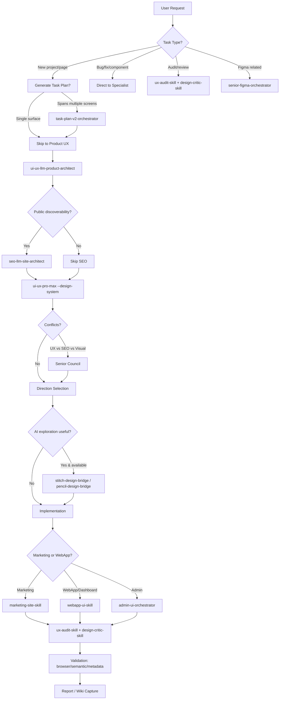

# Skill: UI/UX Orchestrator

**Use esta skill como ponto de entrada único** para qualquer trabalho UI/UX substancial.
Ela **não executa** — orquestra: roteia para specialist skills, gerencia task plans,
resolve conflitos, valida entrega.

**Não use** para tarefas triviais de componente único — use skills specialists direto.

---

## 1. Arquitetura do Sistema

```
                    ┌─────────────────────────────────────┐
                    │    senior-ui-ux-orchestrator        │
                    │         (ESTA SKILL)                │
                    └──────────────┬──────────────────────┘
                                   │
               ┌───────────────────┼───────────────────┐
               ▼                   ▼                   ▼
      ┌──────────────┐    ┌──────────────┐    ┌──────────────┐
      │  PRODUCT UX  │    │  SEO / LLM   │    │ DESIGN INTEL │
      │  LAYER       │    │  LAYER       │    │  (ui-ux-pro- │
      │              │    │              │    │   max)       │
      │ • ux-arch    │    │ • seo-arch   │    │              │
      │ • journey    │    │ • semantic   │    │ • styles     │
      │ • concept    │    │ • schema     │    │ • colors     │
      │ • feedback   │    │ • llm-opt    │    │ • typography │
      └──────┬───────┘    └──────┬───────┘    └──────┬───────┘
             │                   │                   │
             └───────────────────┼───────────────────┘
                                 ▼
                    ┌─────────────────────────────────────┐
                    │      DIRECTION SELECTION            │
                    │  (three-variant | senior-council)   │
                    └──────────────┬──────────────────────┘
                                   │
               ┌───────────────────┼───────────────────┐
               ▼                   ▼                   ▼
      ┌──────────────┐    ┌──────────────┐    ┌──────────────┐
      │   FIGMA      │    │   STITCH     │    │  PENCIL      │
      │  (optional)  │    │  (optional)  │    │  (optional)  │
      └──────┬───────┘    └──────┬───────┘    └──────┬───────┘
             │                   │                   │
             └───────────────────┼───────────────────┘
                                 ▼
                    ┌─────────────────────────────────────┐
                    │      IMPLEMENTATION                 │
                    │  • marketing-site-skill             │
                    │  • webapp-ui-skill                  │
                    │  • admin-ui-orchestrator            │
                    │  • (sua skill: ui-ux-design)        │
                    └──────────────┬──────────────────────┘
                                   │
                                 ▼
                    ┌─────────────────────────────────────┐
                    │      AUDIT & VALIDATION             │
                    │  • ux-audit-skill                   │
                    │  • design-critic-skill              │
                    │  • browser/semantic validation      │
                    │  • workflow-compliance-supervisor   │
                    └──────────────┬──────────────────────┘
                                   │
                                 ▼
                    ┌─────────────────────────────────────┐
                    │      REPORT / WIKI CAPTURE          │
                    │  • project-wiki-manager             │
                    │  • agent-progress-visualizer        │
                    └─────────────────────────────────────┘
```

---

## 2. Specialist Skills Catalog

### Product UX Layer
| Skill | Responsabilidade |
|---|---|
| `ui-ux-llm-product-architect` | Buyer journeys: emotional entry, comparison, trust verification, request path |
| `ux-journey-architect` | User goals, screen states, action priority, accessible names, semantic controls |
| `concept-prototyper` | Rapid concept validation, three-direction exploration |
| `design-feedback-collector` | Stakeholder feedback synthesis, iteration tracking |
| `project-wiki-manager` | Durable project knowledge capture, handoff docs |

### SEO / LLM Layer
| Skill | Responsabilidade |
|---|---|
| `seo-llm-site-architect` | Visible facts, metadata, schema, headings, crawlable structure |
| `semantic-core-builder` | Topic clusters, entity mapping, content architecture |
| `information-architecture-seo` | Site structure, URL taxonomy, internal linking |
| `technical-seo-schema-engineer` | JSON-LD, structured data, rich results |
| `seo-regression-validator` | Crawl health, indexation, Core Web Vitals |
| `llm-friendly-site-architect` | LLM-readable structure, citation optimization |
| `llm-friendly-site-optimizer` | Content formatting for LLM consumption |

### Growth Layer
| Skill | Responsabilidade |
|---|---|
| `site-growth-orchestrator` | Growth strategy coordination |
| `llm-citation-monitor` | Track LLM citations, brand mentions |
| `internal-link-graph-architect` | Link equity distribution, topical authority |
| `editorial-quality-gate` | Content quality standards, E-E-A-T |
| `external-authority-placement-scout` | Partnership, PR, backlink opportunities |
| `backlink-quality-validator` | Link profile health, toxicity check |

### SERP Layer
| Skill | Responsabilidade |
|---|---|
| `serp-source-configurator` | Data sources, APIs, structured feeds |
| `serp-keyword-harvester` | Keyword research, intent mapping, clustering |

### Design Intelligence
| Skill | Responsabilidade |
|---|---|
| `ui-ux-pro-max` | **Sua skill base** — design system generation, 192 rules, 79 styles, 192 palettes, 74 fonts, GSAP, charts, 22 stacks |
| `visual-content-director` | Visual hierarchy, art direction, asset strategy |
| `design-critic-skill` | Premium feel, hierarchy, typography, spacing, anti-slop risks |
| `ux-audit-skill` | Responsive behavior, evidence-backed UX risks, severity-ranked findings |

### AI Design Exploration
| Skill | Responsabilidade |
|---|---|
| `stitch-design-bridge` | Approved directions → Stitch-ready prompts |
| `pencil-design-bridge` | Sketch-to-code exploration |

### Figma Subsystem
| Skill | Responsabilidade |
|---|---|
| `senior-figma-orchestrator` | Routes Figma work, enforces privacy/tool evidence boundaries |
| `figma-context-reader` | Reads frames, nodes, variables, layout, component context |
| `figma-design-to-code-bridge` | Figma structure → implementation-ready component mapping |
| `figma-design-system-sync` | Tokens, variables, component drift, code/design mismatches |
| `figma-assets-manager` | Export/inventory assets for implementation |
| `figma-apply-effects` | Shadows, blur, glass, noise, texture, effect-token binding |

### Build Specialists
| Skill | Responsabilidade |
|---|---|
| `marketing-site-skill` | Public pages: landing, marketing, conversion-focused |
| `webapp-ui-skill` | Dense product UI: dashboards, tables, filters, settings, responsive panels |
| `admin-ui-orchestrator` | Admin panels, CRUD, permissions, bulk actions |
| `admin-ui-builder` | Admin implementation details |
| `site-ai-assistant-builder` | Chat surfaces, streaming, citations, tool traces |
| `omnichannel-comms-builder` | Email, push, in-app, SMS coordination |
| `analytics-setup-architect` | Event schema, tracking plan, privacy compliance |
| `paid-traffic-architect` | Landing pages for ads, conversion tracking |

### Existing Site & Launch
| Skill | Responsabilidade |
|---|---|
| `existing-site-analyzer` | Current state audit, tech debt, performance baseline |
| `rebuild-or-improve-advisor` | Decision framework: rebuild vs incremental |
| `migration-planner` | Phased migration, risk mitigation, rollback |
| `tech-stack-selector` | Framework, hosting, CI/CD, database selection |
| `deploy-orchestrator` | Deployment pipeline, environments, secrets |
| `infra-launch-orchestrator` | Infrastructure provisioning, scaling |
| `launch-readiness-auditor` | Pre-launch checklist, smoke tests, rollback plan |
| `domain-name-generator` | Naming, availability, trademark check |
| `domain-registrar-advisor` | Registrar selection, transfer, management |
| `domain-dns-configurator` | DNS records, CDN, SSL, subdomains |
| `server-selector` | Compute, edge, serverless evaluation |
| `server-provisioner` | IaC, configuration, hardening |
| `ssl-and-security-hardener` | TLS, headers, CSP, HSTS, WAF |
| `web-security-architect` | Threat modeling, OWASP, penetration testing |
| `webmaster-registrar` | Search console, indexing, sitemaps |

### Admin & Compliance
| Skill | Responsabilidade |
|---|---|
| `workflow-compliance-supervisor` | Checks promised journeys vs real artifacts, logs, skips, blockers, evidence |
| `agent-progress-visualizer` | Customer-facing progress cockpit, bootstrap progress screen |
| `task-plan-v2-orchestrator` | Task-plan gates, status, handoffs, verification policy |

---

## 3. Routing Logic (Decision Tree)



---

## 4. Task Plan Gate (Quando Obrigatório)

**Gere task plan** quando:
- Mudança span > 3 screens
- Múltiplos stakeholders
- Requer coordenação Figma + code + SEO
- Migration/rebuild decision
- Launch-readiness envolvido

**Task Plan Structure:**
```markdown
# Task Plan: <nome>

## Objective
[1 frase: outcome mensurável]

## Scope
- In: [screens, components, flows]
- Out: [explicitamente fora]

## Skill Sequence
1. ui-ux-llm-product-architect — [entregável]
2. seo-llm-site-architect — [entregável]
3. ui-ux-pro-max — [entregável]
4. marketing-site-skill — [entregável]
5. ux-audit-skill — [entregável]
6. design-critic-skill — [entregável]

## Gates
- [ ] Product UX approved
- [ ] SEO constraints documented
- [ ] Design system generated + persisted
- [ ] Direction selected (3 variants ou single)
- [ ] Implementation complete
- [ ] Audit passed (severity thresholds)
- [ ] Validation evidence captured

## Handoffs
- Product UX → SEO: journey map + content requirements
- SEO → Design Intel: semantic core + schema requirements
- Design Intel → Implementation: tokens, components, patterns
- Implementation → Audit: deployed URL ou build artifact

## Risks & Mitigations
| Risk | Likelihood | Impact | Mitigation |
|---|---|---|---|
| UX/SEO conflict | High | High | Senior Council rule |
| Figma drift | Medium | High | figma-design-system-sync gate |
| Performance regression | Medium | High | Core Web Vitals budget in task plan |
```

---

## 5. Senior Council (Conflict Resolution)

**Invocar apenas para:**
- UX wants less text, SEO needs visible crawlable content
- Stitch output looks good but fails accessibility
- Figma design system conflicts with feasible implementation
- Visual novelty conflicts with truthful product facts
- Large projects com multiple conflicting constraints

**Decision Priority (ordem):**
1. Security, privacy, legal, user safety
2. Accessibility and primary user task
3. Truthful visible facts
4. Semantic HTML, crawlability, LLM-readable structure
5. Conversion UX and user comprehension
6. Figma/design-system consistency (when Figma in project)
7. Maintainability
8. Visual novelty and AI-generated aesthetics

**Process:**
```
1. Cada skill apresenta posição + evidence
2. Orchestrator aplica priority order
3. Decisão documentada em task plan + project wiki
4. Skills afetados ajustam output
```

---

## 6. Three-Variant Direction Selection

Quando direção incerta (novo projeto, redesign major):

```markdown
# Direction Selection: <Project>

## Variant A: [Name] — [Archetype]
- Pattern: [landing pattern from ui-ux-pro-max]
- Style: [style from ui-ux-pro-max]
- Colors: [palette]
- Typography: [pairing]
- Key differentiator: [one sentence]
- Trade-offs: [what's sacrificed]

## Variant B: [Name] — [Archetype]
...

## Variant C: [Name] — [Archetype]
...

## Recommendation
[Selected variant + rationale mapped to priority order]

## Next Steps
- [ ] Stakeholder review (if applicable)
- [ ] Prototype key screen (Stitch/Pencil if available)
- [ ] Proceed to implementation
```

---

## 7. Validation Gates (Evidence-Based)

**Every gate deve produzir evidence — Ran, Skipped, Planned, Manual.**

| Gate | Skill | Evidence Required |
|---|---|---|
| Product UX | `ui-ux-llm-product-architect` | Journey map, screen states, action priority matrix |
| SEO Constraints | `seo-llm-site-architect` | Semantic core, schema specs, heading structure |
| Design System | `ui-ux-pro-max` | MASTER.md + page overrides persisted |
| Direction | Orchestrator | 3 variants doc + recommendation |
| Implementation | Build specialist | Deployed URL / build artifact + component inventory |
| UX Audit | `ux-audit-skill` | Severity-ranked findings table (Critical/High/Medium/Low) |
| Design Critic | `design-critic-skill` | Visual hierarchy, spacing, anti-slop scorecard |
| Browser Validation | Orchestrator | Screenshots 375/768/1024/1440, console clean, LCP/CLS/INP |
| Semantic Validation | Orchestrator | Heading outline, schema valid, aria labels, landmark regions |
| Workflow Compliance | `workflow-compliance-supervisor` | Promised vs actual matrix, blockers logged |

**Report Format:**
```markdown
# Validation Report: <Project> <Date>

## Gates Status
| Gate | Status | Evidence | Link |
|---|---|---|---|
| Product UX | ✅ Ran | Journey map (5 screens) | wiki/journey.md |
| SEO | ✅ Ran | Semantic core (12 entities) | wiki/seo-core.md |
| Design System | ✅ Ran | MASTER.md + 3 page overrides | design-system/ |
| Direction | ✅ Ran | 3 variants, Variant B selected | wiki/direction.md |
| Implementation | ✅ Ran | Deployed: https://... | build/logs |
| UX Audit | ✅ Ran | 3 Critical, 5 High, 8 Medium | reports/ux-audit.md |
| Design Critic | ✅ Ran | Score: 87/100, 12 findings | reports/critic.md |
| Browser | ⚠️ Manual | Screenshots captured | reports/browser/ |
| Semantic | ✅ Ran | Heading outline valid, schema pass | reports/semantic.md |
| Compliance | ✅ Ran | 0 blockers, 2 skipped (no browser) | reports/compliance.md |

## Summary
[2-3 frases: overall health, blockers, go/no-go]
```

---

## 8. Workflow Compliance Supervisor

**Roda automaticamente ao final** (ou sob demanda):
- Verifica se *promised journeys* match *real artifacts*
- Logs: Ran, Skipped, Planned, Manual
- Blockers: impede "Done" até resolvidos
- Evidence: links para artifacts, não screenshots soltos

**Configuração no task plan:**
```yaml
compliance:
  required_gates:
    - product-ux
    - design-system
    - implementation
    - ux-audit
    - design-critic
  severity_thresholds:
    ux_audit_critical: 0
    ux_audit_high: 2
    critic_score_min: 80
  evidence_required: true
  block_on_critical: true
```

---

## 9. Progress Visualization

Para projetos longos/multi-agent:
- `agent-progress-visualizer` — customer-facing progress cockpit
- Bootstrap progress screen para stakeholder alignment
- Updates automatic via task plan status changes

---

## 10. Integração com suas Skills

| Sua Skill | Papel no Orchestrator |
|---|---|
| `ui-ux-design` | **Design Intelligence Specialist** — chamado em `ui-ux-pro-max` node. Gera design system completo (pattern, style, colors, typo, effects, anti-patterns, checklist). |
| `ui-craft` | **Implementation + Validation Specialist** — chamado em Implementation node (`marketing-site-skill`/`webapp-ui-skill`) + Audit node (`ux-audit-skill`/`design-critic-skill` overlap). Fornece: anti-slop detector, scoring, tokens, brief, finish bar, review agents. |
| `apple-hig` | **Accessibility/UX Reference** — chamado em Audit node. Fornece 53 HIG guidelines generalizados para mobile/desktop. |

---

## 11. Usage Patterns

### Pattern A: New Marketing Site (Full Pipeline)
```
$senior-ui-ux-orchestrator
Create a premium conversion-focused website for a cottage village.
Materials in ./project-assets.
Create three different design versions and validate desktop/mobile.
```
**Skill path:** orchestrator → task-plan → product-architect → seo-architect → ui-ux-pro-max → senior council (if needed) → stitch → marketing-site-skill → design-critic → ux-audit → browser/semantic validation → report

### Pattern B: SaaS Dashboard Refactor
```
$senior-ui-ux-orchestrator
Refactor this SaaS dashboard for better scanning, filtering, table actions, empty states, mobile behavior.
Use existing component system.
```
**Skill path:** orchestrator → task-plan (multi-screen) → product-architect → ui-ux-pro-max → webapp-ui-skill → ux-audit → design-critic → state coverage + visual validation

### Pattern C: Figma to Code
```
$senior-ui-ux-orchestrator
Use the selected Figma frame to prepare an implementation plan.
Map variables, components, assets, effects, and code gaps.
Do not guess missing tokens.
```
**Skill path:** orchestrator → senior-figma-orchestrator → figma-context-reader → figma-design-to-code-bridge → figma-design-system-sync → figma-assets-manager → figma-apply-effects → marketing-site-skill/webapp-ui-skill → ux-audit + design-critic

### Pattern D: Direct Specialist (Bug Fix)
```
$ux-audit-skill
Audit this landing page screenshot and source code. Return severity-ranked findings and a fix brief.
```
**Orchestrator bypassado** — specialist direto.

---

## 12. Installation & Runtime

**Via npm (recommended):**
```bash
npm install -g @mlllm/ui-ux-agent-skill-system
uiux-skills install claude --dest ~/.claude/skills
# ou codex, qwen-code, copilot-vscode, gemini-cli, glm-zai, kimi, generic-agent
```

**Manual (generic agent):**
```bash
git clone https://github.com/sergekostenchuk/ui-ux-agent-skill-system.git
cp -R dist/generic-agent/skills/* /path/to/agent/skills/
```

**Load orchestrator first:**
```
$senior-ui-ux-orchestrator
<your request>
```

---

## 13. Compatibility Matrix

| Runtime | Support | Prebuilt Output |
|---|---|---|
| Codex | Native skill folders | `dist/codex/skills/` |
| Claude / Claude Code | SKILL.md folders | `dist/claude/skills/` |
| Qwen Code | `.qwen/skills` projection | `dist/qwen-code/.qwen/skills/` |
| VS Code / Copilot | `.github/skills` projection | `dist/copilot-vscode/.github/skills/` |
| Gemini CLI | Extension projection | `dist/gemini-cli/ui-ux-agent-skill-system/` |
| GLM / Z.ai | Generic AGENTS.md | `dist/glm-zai/` |
| Kimi | Generic AGENTS.md | `dist/kimi/` |
| Other agents | Portable Markdown | `dist/generic-agent/` |

---

## 14. Safety Defaults

- **Local-first** by default
- **No API keys, tokens, cookies, private URLs, .env, private screenshots, customer data** stored/printed
- **Environment variables** para integrações opcionais (ex: `STITCH_API_KEY`)
- **External services** require explicit user approval + data-transfer note
- **Planned checks ≠ evidence** — reports distinguish Ran/Skipped/Planned/Manual

---

## 15. License

Apache License 2.0 — see LICENSE and NOTICE.

---

## 16. Quick Reference: When to Use What

| Situation | Start With |
|---|---|
| "Build a landing page for X" | `$senior-ui-ux-orchestrator` |
| "Redesign our dashboard" | `$senior-ui-ux-orchestrator` |
| "Audit this page for UX issues" | `$ux-audit-skill` (direct) |
| "Review this design against HIG" | `$apple-hig-skill` (direct) |
| "Generate design system for X" | `$ui-ux-pro-max` (via orchestrator or direct) |
| "Fix anti-slop in this component" | `/ui-craft:heuristic` or `$ui-craft-detect` |
| "Create three design directions" | `$senior-ui-ux-orchestrator` (triggers three-variant) |
| "Sync Figma to code" | `$senior-figma-orchestrator` (via orchestrator) |
| "SEO audit for our site" | `$seo-llm-site-architect` (via orchestrator) |

---

## 17. Exemplo MangaScraper com Orchestrator

```bash
# Single command — orchestrator routes everything
$senior-ui-ux-orchestrator
Redesign MangaScraper (Flask + vanilla HTML/CSS/JS, manga downloader → PDF).
Current UI: basic form + progress + download.
Goals: dark mode for night reading, trust signals (MangaDex only), 
better progress feedback, mobile-first, accessibility compliant.
Create 2 design directions, implement selected, validate.
```

**Orchestrator executa:**
1. `task-plan-v2-orchestrator` — multi-screen? sim (index + loading + success states)
2. `ui-ux-llm-product-architect` — user journey: paste URL → validate → download PDF → read offline
3. `seo-llm-site-architect` — public discoverability? não (tool behind auth? sem SEO)
4. `ui-ux-pro-max` (sua `ui-ux-design`) — `--design-system "manga reader downloader entertainment dark mode"`
5. Direction selection — 2 variants (Dark Mode Premium vs Minimal Functional)
6. `ui-craft` (sua skill) — `/craft landing` + `/finalize` + anti-slop detect
7. `ux-audit-skill` + `design-critic-skill` — severity findings
8. Browser/semantic validation — 4 breakpoints, heading outline, aria
9. `workflow-compliance-supervisor` — promised vs actual
10. Report → `design-system/MangaScraper/` + `reports/`

---

## 18. Princípios Norteadores (Orchestrator)

1. **Single entry point** — todo trabalho UI/UX substancial passa por aqui
2. **Specialists do the work** — orchestrator só roteia, resolve conflitos, valida
3. **Evidence over opinion** — gates produzem artifacts, não vibes
4. **Conflict resolution has priority order** — segurança → acessibilidade → verdade → semântica → conversão → consistência → manutenibilidade → estética
5. **Three-variant when direction uncertain** — não adivinhe, explore
6. **Figma optional, not required** — só invoca quando artifact Figma existe
7. **AI exploration optional** — Stitch/Pencil só quando useful + available
8. **Compliance = promised vs actual** — workflow supervisor é o gate final
9. **Progress visible** — stakeholder cockpit para projetos longos
10. **Document decisions** — task plan + wiki = institutional memory